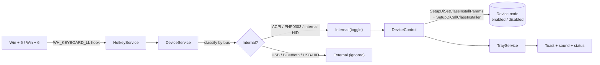

<div align="center">


# Dekeyboard

**Disable your laptop's built-in keyboard with a hotkey — perfect for 360° convertibles in tablet mode.**

A tiny, silent Windows tray app that turns **only** the internal keyboard (and optionally the touchpad) on/off, so your palms stop typing garbage when the screen is folded back.


</div>

> [!NOTE]
> Built for 360° convertibles such as the **iLife ZEDNote CX5** whose firmware doesn't auto-disable the keyboard when folded into tablet mode. It works on **any** Windows 10/11 laptop, though.

---

## Table of contents

- [Features](#features)
- [Quick demo](#quick-demo)
- [Install & run](#install--run)
- [How it works](#how-it-works)
- [How the internal keyboard is identified](#how-the-internal-keyboard-is-identified)
- [Hotkeys & configuration](#hotkeys--configuration)
- [Tray menu](#tray-menu)
- [Build from source](#build-from-source)
- [Package as a single EXE](#package-as-a-single-exe)
- [Project structure](#project-structure)
- [Troubleshooting](#troubleshooting)
- [FAQ](#faq)
- [Verified test output](#verified-test-output)
- [License](#license)

---

## Features

| | Feature |
|---|---|
| ✅ | **`Win`+`5`** disables **only** the built-in keyboard |
| ✅ | **`Win`+`6`** re-enables it |
| ✅ | USB & Bluetooth keyboards are **never** touched (incl. USB-HID, via device-tree check) |
| ✅ | Auto-detects the internal keyboard (no manual setup) |
| ✅ | Runs silently in the **system tray** with a custom icon |
| ✅ | **Starts with Windows** (elevated, no login UAC prompt) |
| ✅ | Toast **notifications**: *"Laptop keyboard disabled / enabled"* |
| ✅ | Global hotkeys that work in **any** app |
| ✅ | No Device Manager, **no reboot**, no driver uninstall — fully reversible |
| ✅ | Auto-requests **administrator** elevation |
| ✅ | Errors handled gracefully and **logged** to a file |
| 🎁 | **Bonus:** toggle from the tray (menu + double-click) |
| 🎁 | **Bonus:** live keyboard status in the menu |
| 🎁 | **Bonus:** optional **sound** on toggle |
| 🎁 | **Bonus:** fully **configurable hotkeys** |
| 🎁 | **Bonus:** optionally disable the **touchpad** together with the keyboard |
| 🛟 | **Safety:** re-enables the keyboard automatically on exit — you can't get locked out |

---

## Quick demo

```text
  +-----------------------------------------------+
  |  Fold screen back -> tablet mode              |
  |                                               |
  |        press  Win + 5                          |
  |            v                                  |
  |   [x]  "Laptop keyboard disabled"             |
  |        (palms can't type anymore)             |
  |                                               |
  |        press  Win + 6                          |
  |            v                                  |
  |   [/]  "Laptop keyboard enabled"              |
  +-----------------------------------------------+
```

---

## Install & run

### Option A — grab the prebuilt EXE

1. Download **`Dekeyboard.exe`** from the [Releases](../../releases) page.
2. Double-click it → accept the **UAC** prompt.
3. A tray icon appears. Press **`Win`+`5`** / **`Win`+`6`**. Done.

> The self-contained EXE bundles the .NET runtime, so nothing else needs installing.

### Option B — build it yourself

See [Build from source](#build-from-source).

---

## How it works



**Two Windows internals do the heavy lifting:**

<details>
<summary><b>1. Global hotkeys via a low-level keyboard hook</b> (click to expand)</summary>

<br/>

The Windows shell **reserves** `Win`+`<number>` (they switch taskbar apps), so the usual `RegisterHotKey(MOD_WIN, '5')` **fails**. Instead we install a **`WH_KEYBOARD_LL`** hook that sees every keystroke *before* the shell, fires our action, and **suppresses** the keystroke so the taskbar doesn't react. This makes `Win`+`5`/`Win`+`6` reliable — and every hotkey remains configurable.

</details>

<details>
<summary><b>2. Enable/disable via the supported SetupAPI</b> (click to expand)</summary>

<br/>

`DeviceControl` calls the exact sequence Device Manager itself uses:

```text
SetupDiSetClassInstallParams(DIF_PROPERTYCHANGE, DICS_DISABLE | DICS_ENABLE, DICS_FLAG_GLOBAL)
SetupDiCallClassInstaller(DIF_PROPERTYCHANGE, ...)
```

This is a **first-party Microsoft API**, is fully **reversible**, does **not** uninstall the driver, and needs **no reboot**. (The same thing is possible with the shipped `pnputil /disable-device "<InstanceId>"` — see the [FAQ](#faq).)

</details>

---

## How the internal keyboard is identified

Every keyboard — built-in, USB, or Bluetooth — lives under the **Keyboard** setup class. The app enumerates that class and marks a device **external** when either of these is true:

1. its own **enumerator** is `USB` or `BTH…` (a plain USB / Bluetooth keyboard), **or**
2. an **ancestor in the device tree** sits on the USB or Bluetooth bus — this catches
   **USB-HID** keyboards, which report enumerator `HID` but whose parent is `USB`.

> Step 2 uses CfgMgr32 (`CM_Get_Parent` / `CM_Get_Device_ID`) to walk up the device tree. It's what lets Dekeyboard keep an **internal** I²C/HID keyboard while still ignoring an **external** USB-HID keyboard, even though both share the `HID` enumerator.

Among the remaining **internal** candidates it prefers, in order:

| Priority | Match | Typical device |
|---|---|---|
| 1 | hardware id contains **`PNP0303`** | Standard PS/2 keyboard |
| 2 | enumerator **`ACPI`** | Built-in keyboard controller |
| 3 | enumerator **`HID`** (not behind USB/BT) | I²C keyboard on 2-in-1s |
| 4 | first remaining candidate | fallback |

Every candidate is logged with an `internal` / `EXTERNAL` tag and the final pick is shown, so you can always verify what happened. The touchpad is found the same way under the **Mouse** class, preferring a device described as a *"touch pad"*.

> [!TIP]
> **Auto-detection wrong?** Open `%APPDATA%\Dekeyboard\config.json`, set
> `"KeyboardInstanceId": "ACPI\\...\\..."` (and `"TouchpadInstanceId"`) to the exact id
> from the log, and restart. Your explicit choice always wins.

<details>
<summary>⚙️ <b>Technical note: the class-GUID gotcha</b></summary>

<br/>

The Keyboard/Mouse **device setup class** GUIDs end in **`BFC1`**, not `BFC8`:

```
GUID_DEVCLASS_KEYBOARD = {4D36E96B-E325-11CE-BFC1-08002BE10318}
GUID_DEVCLASS_MOUSE    = {4D36E96F-E325-11CE-BFC1-08002BE10318}
```

Using `BFC8` makes `SetupDiGetClassDevs` return **zero** devices with no error. This was caught and fixed during on-device testing (see [Verified test output](#verified-test-output)).

</details>

---

## Hotkeys & configuration

Config lives at **`%APPDATA%\Dekeyboard\config.json`** (created on first run). Edit it, then restart the app — or use the tray menu for the common toggles.

```jsonc
{
  // Disable the internal keyboard
  "DisableHotkey": { "Win": true, "Ctrl": false, "Alt": false, "Shift": false, "Key": "5" },
  // Enable it again
  "EnableHotkey":  { "Win": true, "Ctrl": false, "Alt": false, "Shift": false, "Key": "6" },

  "PlaySound": true,                    // sound on toggle
  "DisableTouchpadWithKeyboard": false, // also disable the touchpad
  "SuppressHotkeyKeystroke": true,      // swallow the key so the taskbar ignores Win+5/6

  "KeyboardInstanceId": null,           // set to pin a specific keyboard
  "TouchpadInstanceId": null            // set to pin a specific touchpad
}
```

| Setting | Type | Default | Meaning |
|---|---|---|---|
| `DisableHotkey` / `EnableHotkey` | object | `Win+5` / `Win+6` | Modifier flags + a `Key` (`"5"`, `"K"`, `"F9"`, …) |
| `PlaySound` | bool | `true` | Play a system sound on each toggle |
| `DisableTouchpadWithKeyboard` | bool | `false` | Disable the internal touchpad alongside the keyboard |
| `SuppressHotkeyKeystroke` | bool | `true` | Prevent the hotkey from also reaching other apps |
| `KeyboardInstanceId` | string? | `null` | Force a specific keyboard device instance id |
| `TouchpadInstanceId` | string? | `null` | Force a specific touchpad device instance id |

**Prefer non-reserved hotkeys?** Set e.g. `"Ctrl": true, "Alt": true, "Key": "K"` for `Ctrl`+`Alt`+`K`.

---

## Tray menu

Right-click the tray icon (double-click = quick toggle):

```text
+---------------------------------+
| Status: keyboard enabled        |   <- live status
+---------------------------------+
| Disable laptop keyboard         |   <- manual toggle
+---------------------------------+
| [x] Play sound on toggle        |
| [ ] Also disable touchpad       |
| [x] Start with Windows          |
+---------------------------------+
| View log...                     |
| Quit                            |
+---------------------------------+
```

---

## Build from source

**Prerequisites:** [.NET 8 SDK](https://dotnet.microsoft.com/download/dotnet/8.0) (Windows).

```powershell
git clone https://github.com/<you>/dekeyboard.git
cd dekeyboard

dotnet restore
dotnet build -c Release

# Run (UAC prompt appears — the app requires administrator)
dotnet run --project Dekeyboard
```

Or open **`Dekeyboard.sln`** in Visual Studio 2022 (17.8+) with the *.NET desktop development* workload and press **F5**.

---

## Package as a single EXE

**Self-contained** (no runtime needed on the target, ~138 MB):

```powershell
dotnet publish Dekeyboard -c Release -r win-x64 `
  -p:PublishSingleFile=true --self-contained true `
  -p:IncludeNativeLibrariesForSelfExtract=true
```

**Framework-dependent** (tiny, needs the .NET 8 Desktop Runtime installed):

```powershell
dotnet publish Dekeyboard -c Release -r win-x64 `
  -p:PublishSingleFile=true --self-contained false
```

Output: `Dekeyboard\bin\Release\net8.0-windows\win-x64\publish\Dekeyboard.exe`
On ARM convertibles, use `-r win-arm64`.

---

## Project structure

```
Dekeyboard/                         (repo root)
├── Dekeyboard.sln
├── README.md · LICENSE · .gitignore
├── docs/
│   └── icon.png                    # icon used in this README
└── Dekeyboard/
    ├── Dekeyboard.csproj           # .NET 8 WPF + WinForms tray, requires admin
    ├── Dekeyboard.ico              # app + embedded tray icon
    ├── app.manifest                # requireAdministrator + PerMonitorV2
    ├── appsettings.json            # config template (live config is in %APPDATA%)
    ├── App.xaml(.cs)               # headless composition root, elevation, wiring
    ├── Configuration/
    │   └── AppConfig.cs            # JSON config: hotkeys, sound, touchpad, overrides
    ├── Interop/
    │   ├── NativeMethods.cs        # SetupAPI + CfgMgr32 + low-level keyboard hook
    │   └── DeviceControl.cs        # enumerate, device-tree walk, enable/disable
    └── Services/
        ├── Logger.cs               # thread-safe file logger
        ├── DeviceService.cs        # identifies the internal keyboard/touchpad
        ├── HotkeyService.cs        # global hotkeys via WH_KEYBOARD_LL
        ├── StartupService.cs       # "start with Windows" via elevated Scheduled Task
        └── TrayService.cs          # NotifyIcon, menu, notifications, sound, icon
```

**Runtime data (never in the repo):** `%APPDATA%\Dekeyboard\` → `config.json`, `log.txt`.

---

## Troubleshooting

<details>
<summary><b>Hotkeys don't do anything</b></summary>

- Check `%APPDATA%\Dekeyboard\log.txt` — the line `Hotkeys active: …` confirms the hook installed.
- Another app may hold a conflicting low-level hook. Try different keys (e.g. `Ctrl`+`Alt`+`K`).
- Make sure the app is actually running (tray icon present) and elevated.
</details>

<details>
<summary><b>It toggled the wrong keyboard / touchpad</b></summary>

- Open the log — it lists every keyboard with an `internal` / `EXTERNAL` tag and which one was selected.
- Copy the correct instance id into `KeyboardInstanceId` (and `TouchpadInstanceId`) in `config.json`, then restart.
</details>

<details>
<summary><b>Auto-start shows a UAC prompt at login</b></summary>

It shouldn't — auto-start uses a *"Run with highest privileges"* Scheduled Task that starts elevated silently. If you see a prompt, toggle **Start with Windows** off and on again in the tray menu to recreate the task.
</details>

<details>
<summary><b>Keyboard still types after being "disabled"</b></summary>

A few I²C/HID internal keyboards keep sending input even when the device node is disabled (a firmware quirk). If your machine does this, open an issue — a low-level *input-blocking* mode (filter at the hook instead of disabling the device) can be added as a fallback.
</details>

---

## FAQ

<details>
<summary><b>Does this uninstall my keyboard driver?</b></summary>
No. It flips the device node's enabled/disabled state — the same reversible action as Device Manager's right-click → Disable. Nothing is uninstalled and no reboot is needed.
</details>

<details>
<summary><b>Will it disable my USB or Bluetooth keyboard?</b></summary>
No. Devices whose enumerator is <code>USB</code> or <code>BTH…</code> — <i>or</i> whose device-tree parent is on the USB/Bluetooth bus (USB-HID keyboards) — are excluded.
</details>

<details>
<summary><b>Why does it need administrator rights?</b></summary>
Changing a device's enabled state through SetupAPI requires elevation. The app requests it automatically (UAC) and, for auto-start, uses an elevated Scheduled Task so you're not prompted at every login.
</details>

<details>
<summary><b>Can I use PnPUtil instead?</b></summary>
Yes — the same effect is achievable with the built-in CLI:

```powershell
pnputil /disable-device "ACPI\PNP0303\4&xxxx&0"
pnputil /enable-device  "ACPI\PNP0303\4&xxxx&0"
```

Dekeyboard uses the in-process SetupAPI path by default (faster, no external process). Get instance ids with `pnputil /enum-devices /class Keyboard`.
</details>

<details>
<summary><b>What if the app crashes while the keyboard is disabled?</b></summary>
On normal exit it auto-re-enables the keyboard. If it's force-killed while disabled, just relaunch and press the enable hotkey, or re-enable the device in Device Manager (you have the touchscreen / an external keyboard to do so).
</details>

---

## Verified test output

Real first-run detection on a Windows 11 laptop (from `log.txt`):

```log
[INFO ] === Dekeyboard starting ===
[INFO ] Hotkeys active: disable='Win + 5', enable='Win + 6'.
[INFO ] Found 2 keyboard device(s):
[INFO ]     - EXTERNAL | HID Keyboard Device    | enum=HID  | id=HID\VID_3151&PID_5031&MI_01&COL03\7&1B5E007A&0&0002
[INFO ]     - internal | Standard PS/2 Keyboard | enum=ACPI | id=ACPI\1025171E\4&33EE29D&0
[INFO ] Selected internal keyboard: Standard PS/2 Keyboard [ACPI\1025171E\4&33EE29D&0]
[INFO ] Dekeyboard ready (running in tray).
```

✔️ Builds clean (`0 warnings, 0 errors`) · ✔️ elevates via UAC · ✔️ installs the global hook · ✔️ the device-tree walk correctly tags the USB-HID keyboard **EXTERNAL** and picks the **internal** PS/2 keyboard.

---

## License

[MIT](LICENSE) © 2026 Rahul Singh

<div align="center">
<sub>Made for convertibles that forgot how to fold. If it saved your tablet-mode sanity, ⭐ the repo.</sub>
</div>
